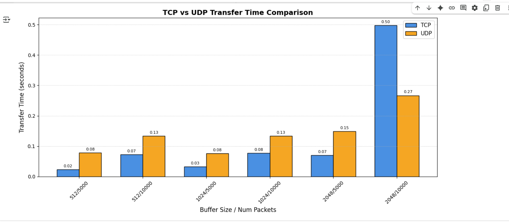

# TCP vs UDP Performance Analysis using Cloud-hosted Testbed 🚀

This project compares the performance of TCP and UDP protocols by measuring the time taken to send a large number of packets between two AWS EC2 instances. The goal is to understand how different buffer sizes and packet counts affect transfer speeds using real cloud infrastructure.

## 🌐 Setup

- Two Ubuntu EC2 instances on AWS
- One acts as the sender, the other as the receiver
- Security group allows TCP/UDP on port 9999 and SSH on port 22
- SSH access done via WSL on Windows
- Python 3 installed on both instances

## 🧠 How It Works

- sender.py sends data using either TCP or UDP
- receiver.py listens and receives the data
- Multiple tests run with different buffer sizes and packet counts
- Transfer time is measured and logged in results.txt
- A bar graph is generated using Google Colab and matplotlib

## 📁 Files

- sender.py: Python script to send data
- receiver.py: Python script to receive data
- results.txt: Logged output of all tests
- tcp_udp_comparison.png: Final graph comparing TCP vs UDP
- README.md: You’re reading it 😉

## 🧪 Test Parameters

| Buffer Size (bytes) | Packet Count |
|---------------------|--------------|
| 512                 | 5000, 10000  |
| 1024                | 5000, 10000  |
| 2048                | 5000, 10000  |

Each combination was tested for both TCP and UDP.

## 📊 Sample Output (Graph)

## 💡 Conclusion

UDP is generally faster but less reliable, while TCP is slower due to connection handling but more reliable. This testbed demonstrates how protocol choice and data configuration affect performance in real-world cloud networks.

---

i need the codes that we used also inbuilt in this.
